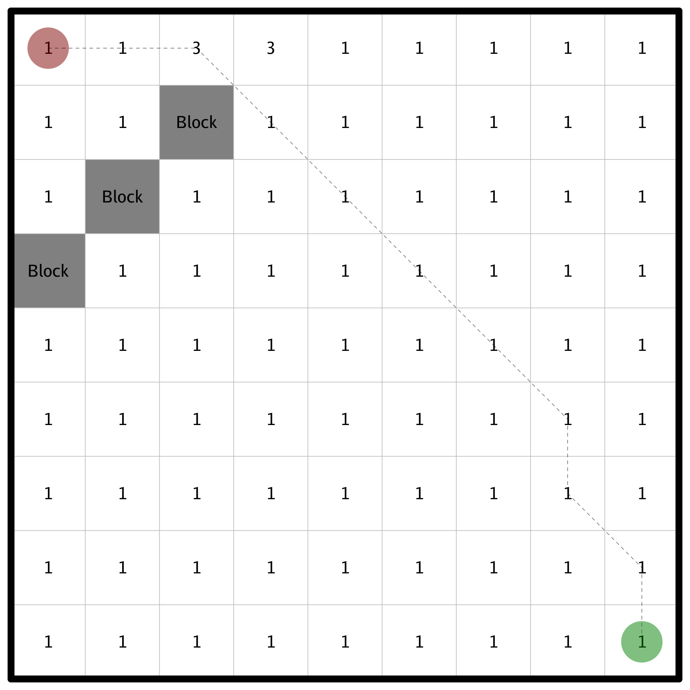

### Description

Implement the A* algorithm. A* is a graph traversal and path search algorithm

### Example:

```
Input: Start (0,0) Goal (8,8)

[1 1 1 3 1 1 1 1 1]
[1 1 X 1 1 1 1 1 1]
[1 X 1 1 1 1 1 1 1]
[X 1 1 1 1 1 1 1 1]
[1 1 1 1 1 1 1 1 1]
[1 1 1 1 1 1 1 1 1]
[1 1 1 1 1 1 1 1 1]
[1 1 1 1 1 1 1 1 1]
[1 1 1 1 1 1 1 1 1]

Output:

Distance: 15.313708498984763

[* * * 3 1 1 1 1 1]
[1 1 X * 1 1 1 1 1]
[1 X 1 1 * 1 1 1 1]
[X 1 1 1 1 * 1 1 1]
[1 1 1 1 1 1 * 1 1]
[1 1 1 1 1 1 1 * 1]
[1 1 1 1 1 1 1 * 1]
[1 1 1 1 1 1 1 1 *]
[1 1 1 1 1 1 1 1 *]
```



*Image generated using https://github.com/shomali11/gridder*